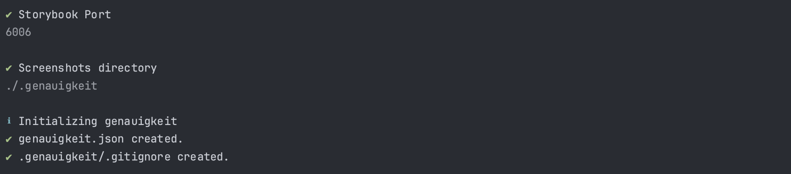

# Quickstart

Install the library:

```sh
npx nypm add genauigkeit
```



:::warning Requirements

-   Node.js 20 or higher
-   Docker

:::

## Initialize configuration

Generate a configuration file by running the following command:

```sh
npx genauigkeit init
```

## Generate References

:::info
To create references or run tests, storybook needs to be running and accessible.
:::
To generate reference screenshots, execute the following command:

```sh
npx genauigkeit reference
```

## Run Tests

To run tests, execute the following command:

```bash
npx genauigkeit test
```

## package.json

You can also add scripts to your package.json:

```json
{
    "scripts": {
        "genauigkeit:generate": "genauigkeit generate",
        "genauigkeit:test": "genauigkeit test"
    }
}
```
